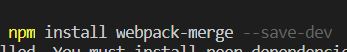
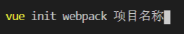
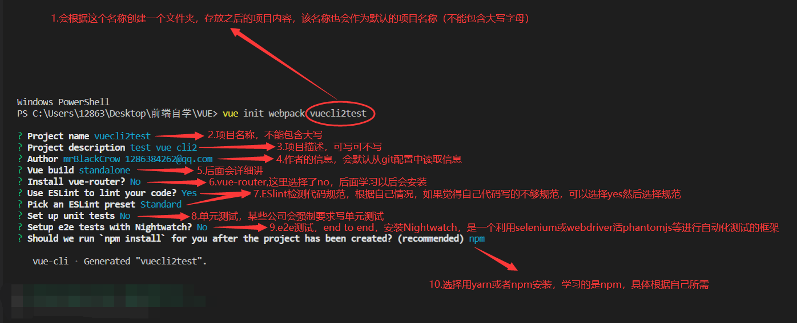
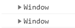
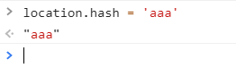
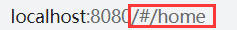
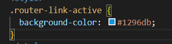

# Vue Day 01

### 一. 邂逅Vuejs

#### 1.1 认识Vuejs

- 为什么学习Vuejs
- Vue的读音
  Vue (读音 /vjuː/，类似于 **view**)

- Vue的渐进式
- Vue的特点

#### 1.2 安装Vue

- CDN引入
- 下载引入
- npm安装

#### 1.3 Vue的初体验

- Hello Vuejs
  - mustache -> 体验vue响应式

- Vue列表展示
  - v-for
  - 后面给数组追加元素的时候，新的元素也可以在界面中渲染出来
- Vue计数器小案例
  - 事件监听：click ->methods

#### 1.4 Vue中的MVVM

#### 1.5 创建Vue时，options可以放哪些东西

- el:
- data:
- methods:
- 生命周期函数

### 二、插值语法

- mustache语法
- v-once
- v-html
- v-text
- v-pre: 直接跳过Vue的解析过程，将原本包含{{}}的内容展示出来
- v-cloak:斗篷

### 三、动态绑定属性 v-bind

#### 3.1 v-bind绑定基本属性

- v-bind: src
- v-bind: href

#### 3.2 v-bind动态绑定class

- 对象语法：class='{类名:boolean}'
- 数组语法：

#### 3.3 v-bind动态绑定style

- 对象语法：
- 数组语法：

### 四、计算属性

- 案例一：firstName + lastName
- 案例二：books ->price

#### 4.1 计算属性的本质

- fullname: {set(), get()}

#### 4.2 计算属性和methods的对比

- 计算属性在多次使用时，只会调用一次
- 计算属性有缓存

# Vue Day 02

### 一、事件监听

#### 1.1 事件监听的基本使用

- v-on
- 语法糖：@

#### 1.2 参数问题

- btnClick
  不需要传递参数时括号可以省略
- btnClick(event)
  若省略了括号，但是调用了参数，默认传递的是触发事件的event对象
- btnClick(abc,event) -> $event
  若传递了参数（abc），同时也需要event时，通过$event传递

#### 1.3 修饰符

- .stop()
  阻止冒泡
- .prevent()
- .enter
  限定触发按键为enter，类似按键很多
- .once
  只触发一次
- .native

### 二、条件判断

#### 2.1 v-if/v-else-if/v-else

#### 2.2 登录小案例

- 小问题：遇到判断切换时，input框内已输入的内容没有切换
  原因是Vue内部的Diff算法问题，解决方案为添加一个不同的key属性值

#### 2.3 v-show

- v-show和v-if的区别
  - v-show是改变了元素的display样式使其隐藏或者显示
  - v-if是选择是否渲染该元素，若为false，则不渲染，DOM树里就不存在该元素

### 三、循环遍历

- v-for

#### 3.1 遍历数组

- 有索引值和没有索引值的情况

#### 3.2 遍历对象

- value
- value,key
- value,key,index

#### 3.3 数组的哪些方法是响应式的

#### 3.4 作业完成

### 四、书籍案例

- 实现书籍响应式的添加、删除，购买数量的添加和减少，以及价格的汇总
- 当书籍全部清空时，隐藏界面，显示提示信息：购物车为空

### 五、v-model的使用

#### 5.1 基本使用

- v-model 原理=> v-bind:value v-on:input

#### 5.2 v-model和radio/checkbox/select的配合使用

#### 5.3 修饰符

- lazy
  等用户输入框接收enter或者失去焦点时修改
- number
  讲输入内容转换为数值处理
- trim
  清楚输入内容左右的空格

### 六、组件化开发

#### 6.1 认识组件化

- 组件化的概念
  将较为复杂的逻辑处理页面分隔成较为简单可处理的几个小的组件进行逻辑处理
- 组件化的步骤

#### 6.2 组件的基本使用过程

#### 6.3 全局组件和局部组件

#### 6.4 父组件和子组件的概念

#### 6.5 组件注册的语法糖

#### 6.6 组件模板的分离写法

- script写法
- template写法

#### 6.7 数据的存放

- 子组件不能直接访问父组件
- 子组件中有自己的data
  data必须是一个函数，有返回值（可返回一个对象）
- 子组件的data为什么必须是一个函数

#### 6.8 父子组件的通信

- 父传子
  - props()
- 子传父
  - $emit()

# Vue Day 03

### 一、组件化开发补充

#### 1.1 父子组件的访问

- $children/$refs
- $parent/$root

#### 1.2 插槽slot的使用

- 基本使用
- 具名插槽
  - 给插槽起id，根据id查找替换某一个插槽
- 编译作用域
  - 编译整个模板时的，在里面使用的变量，都只会在当前作用域里查找
- 作用域插槽
  - 父组件对子组件展示内容的方式不满足，父组件决定自己展示，但数据来自于子组件

### 二、前端模块化开发

#### 2.1 为什么要使用模块化

- 简单写js代码带来的问题

  - 全局变量命名冲突的问题

  - 
  - 

- 闭包引起的问题

  - 代码不可复用

- 实现了简单的模块化

- AMD/CMD/CommonJS模块化开发规范

#### 2.2 ES6中模块化的使用

- export导出
- import导入

### 三、webpack

#### 3.0 webpack和grunt/gulp的对比（面试可能会问）

- grunt/gulp的核心是Task
  - 可以配置一系列的task，并且定义task要处理的事务（例如ES6、ts转化，图片压缩，scss转成css）
  - 之后让grunt/gulp来依次执行这些task，而且让整个流程自动化
  - grunt/gulp也被称为前端自动化任务管理工具
- 与webpack的不同
  - grunt/gulp更加强调的是**前端流程的自动化**，模块化不是他的核心
  - webpack更加强调**模块化**开发管理，而文件压缩合并、预处理等功能，送他附带的功能

#### 3.1 webpack安装

  - 首先安装Node.js，Node.js自带了软件包管理工具npm

  - 查看自己的node版本
    
    
  - 全局安装webpack（这里安装3.6.0是因为vue2 cli依赖该版本）
    
    
  - 局部安装webpack
    - --save--dev 是开发时依赖，项目打包以后不需要继续使用的
    
    
    

#### 3.2 准备工作

  - dist文件夹：用于存放之后打包的文件
  - src文件夹：用于存放我们写的源文件
    - index.js：项目的入口文件
    - mathUtils.js：定义了一些数学工具函数，可以在其他地方引用，并且使用
  - index.html：浏览器打开的展示的首页
  - package.json：通过 npm init 在终端生成，npm包管理的文件

    
#### 3.3 入口和出口
  - 每次使用webpack的命令都需要写入入口和出口作为参数，就非常麻烦，创建一个webpack.config.js文件来解决
  - 

#### 3.4 局部安装webpack

  - 使用的webpack打包是全局的webpack，如果想用局部来打包
    - 因为一个项目往往以来特定的webpack版本，全局的版本可能跟这个项目的webpack版本不一致，导致打包出现问题。
    - 所以通常一个项目，都有自己的局部webpack
  - 第一步，在项目中需要安装自己的局部webpack
    - 这里我们让局部安装webpack3.6.0
    - Vue CLI3中已经升级到webpack4，但是他将配置文件隐藏了起来，查看起来不是很方便
  - 第二步，通过 node_modules/.bin/webpack 启动webpack打包

#### 3.5 package.json中定义启动

  - 每次都敲上面那一长串很不方便，所以在package.json中的scripts中定义自己的执行脚本
    

  - package.json中的scripts的脚本在执行时，会按照一定的顺序寻找命令对应的位置
    - 首先，会寻找本地的node_modules/.bin路径中对应的命令
    - 如果没有找到，就会去全局的环境变量中寻找
    - 如何执行build指令
      

#### 3.6 webpack的loader

- loader是webpack中的非常核心的概念
- loader的作用
  - 主要使用webpack来处理js代码，以及js代码之间的一些依赖，而处理其他文件以及他们的依赖时webpack就无法做到
  - 给webpack扩展对应的loader，可以将需要加载的css、图片，也包括一些高级的将ES6转成ES5代码，将Typescript转换城ES5代码，将scss、less转成css，将.jsk、.vue文件转成js文件等等
- loader使用过程：
  - 步骤一、通过npm安装需要使用的loader
  - 步骤二、在webpack.config.js中的modules关键字下进行配置
- 大部分loader都可以在webpack的官网中找到，并且学习对应的用法
- 注意：**webpack在读取使用的loader时，是按照从右往左的顺序读取**，所以配置loader的顺序应该从右往左

#### 3.7 less文件处理 less-loader

- 准备工作
  - 若希望项目中使用less、scss、stylus来写样式，webpack打包配置大同小异
  - 以less为例
- 1.创建一个less文件，依然放在css文件夹中
  
- 在index.js添加依赖（添加依赖以后，打包时webpack会去寻找并进行打包）
  
- 官网查找并下载less的loader
  
- webpack.config.js里配置部署
  
- 在终端npm run build进行打包即可

#### 3.8 webpack-图片文件的处理

- 在样式中插入图片后直接打包会报错
  
- 官网寻找对应loader-文件loader-URLloader，并安装该loader
  
- webpack.config.js里配置部署
  
- 注意limit是限制图片大小（一般为**8192**），当图片小于limit时，会将图片编译成base64字符串形式展示，若图片大于limit，则会报错
  
- 当图片大小超出limit，他会去查找file-loader进行加载，则要么更改limit，要么**安装file-loader**
- 然后会将该图片进行打包到dist文件夹中（自动生成）
  
- 如上图，webpack自动生成了一个非常长的名字
  - 这是一个32位的hash值，目的是防止名字重复
  - 真实开发中可能对打包的图片名字有一定的要求
  - 所以可以在options中添加如下选项：
    - img：文件要打包到的文件夹
    - name：获取图片原来的名字，放在该位置
    - hash:8：为了防止图片名称冲突，依然使用hash，但只保留8位
    - ext：使用图片原来的扩展名
      
      生成的图片
      
- 生成路径不同，所以不会显示，需要在webpack.config.js里更改配置，更改后会自动在url路径前添加文件夹路径
  
  
- 注意：**一般实际开发中index.html文件也会被放入dist中，所以可能不需要更改路径配置，需要时记得删除**

#### 3.9 ES6语法转ES5语法处理（babel-loader）

- 如果你仔细阅读webpack打包的js文件夹，发现写的ES6语法并没有转成ES5的语法，那么就意味着一些可能对ES6还不支持的浏览器没有办法很好的运行代码
- 如果希望将ES6语法转成ES5语法，就需要使用babel。
  - 直接使用babel对应的loader就可以了
- 安装和配置方法查询webpack官网

#### 3.10 ★webpack的Vue配置（Vue的npm安装）

- 后续项目中，会使用Vuejs进行开发，会以特殊的文件（.vue的形式）来组织Vue的组件
- 所以需要在webpack环境中集成Vuejs
- 首先安装依赖（注意：实际项目中也会使用Vue，所以**不是开发时依赖**）
  

- 然后在index.js中进行引用依赖即可（**注意“vue”的大小写要与后面配置一致**），之后就可以在js内用Vuejs写代码
  

- **打包项目-错误信息**
  - 修改完成后重新打包，运行程序，打包过程没有错误，但运行程序没有得到想要的结果，浏览器报错
    
  - 这个错误说的是使用的是runtime-only版本的Vue
    - Vue不同版本的构建，有runtime-only和runtime-compiler的区别（后续会讲）
      - runtime-only -> 代码中不可以有任何的template
      - runtime-compiler -> 可以有template，因为有compiler可以用于编译template
  - 所以许要修改webpack.config.js的配置(**注意“vue$”大小写要与index.html引入vue时的“vue”大小写一致**)
    

#### 3.11 webpack中Vue的书写

- el和template的区别

  - 正常运行后，如果希望将Vue实例的data中的数据显示在界面中，就必须是修改index.html
- 如果后面定义了组件，也必须修改index.html来使用
  - 但是html模板在之后的开发中，并不希望手动的来频繁修改（如何解决？）
  - 所以可以定义一个template属性：
  
  - 定义template后，会将template内容自动替换掉el挂载的.html文件中的标签内（上图中的会**替换掉整个id为“#app“的div**）

#### 3.12 ★webpack组件和模板的抽离（模块化）

- 接上(3.11)，将内容全部写入实例中(特别是template内容的书写)，当代码量变大时会变得非常的繁琐，所以会选择将代码抽离
  - 在src下新建一个名为"vue"的文件夹，在内部可以建立一个app.js文件，将实例中的data、template、methods、computed等可使用的属性及内容抽离到app.js文件中，并匿名导出
    
  - 之后在index.js中导入该文件
    
  - 然后在Vue实例中通过components引入该组件，并在template属性中使用即可
    

- 但是即便如此，在app.js文件中写入代码也还是非常的不方便，template属性中的代码还是无法得到快捷输入方式和格式化，所以我们可以使用新的一种文件格式：.vue文件格式

  - 可在vue文件夹下新建一个App.vue文件（开头推荐大写）

  - 在该文件内写入template标签，并将app.js中的template内容抽离到该标签内（h2中的class属性可写样式，如下文）
    

  - 写入一个script标签，将app.js文件中的其他属性和内容写入为一个新的组件并且匿名导出
    

  - 若有需求要对该组件进行样式修改，可以写入一个style标签，并对template标签内的元素编写样式
    

  - 此时原来的app.js文件就失去作用，index.js中引入的文件更改为
    

    

#### 3.12-拓展 组件的使用

- 3.12中实现了对实例的组件化抽离，那如果在该实例中想要创建新的组件模板和注册组件该怎么办？
  - 在vue文件夹中新建一个Cpn.vue的文件，在该文件中写入创建的新组件—Cpn，并**匿名导出**
    
  - 在Vue实例文件app.vue中的script标签中**命名导入**该文件
    
  - 在实例组件内通过components属性引入即可
    

​    

#### 3.13 .vue文件封装处理

- 一个组件以一个js对象的形式进行组织和使用是非常不方便的
  - 编写template模块非常的麻烦
  - 如果有样式的话，书写比较麻烦
- 可以使用**.vue文件**的方式来组织vue的组件
- 但是文件在先基础上无法被正常加载
  - 特殊的文件以及特殊的格式，需要loader来帮助处理
  - 安装vue-loader和vue-template-compiler
    
- 然后修改webpack.config.js的配置文件
  

- 此时运行可能会遇到一个问题，终端可能报错（vue-loader有许多版本，从14.x版本开始使用就需要配置另一个插件plugin，下文讲解）
  
  - 解决方案可在package.json文件中将vue-loader版本进行手动更改（图中表示会在13.x到14版本之间安装一个版本）
    
  - 然后进行配置安装：即可

#### 3.13-拓展 .vue文件在import导入时后缀名省略问题

- 在前面所讲的各种loader的使用中，可以发现在import引入文件时，路径文件的后缀名可以省略也不会出现问题（如.js、.less、.css等），但是.vue文件则无法省略，否则会出现找不到文件的报错
- 解决方式：修改package.config.js文件中的配置
  - 在resolve对象中新增一个属性，并赋值，值为想要省略的后缀名（以 **.后缀名** 的形式）：
    

#### 3.14 plugin的基本使用

- 认识plugin
  - plugin是插件的意思
    - webpack中的插件，就是对webpack现有功能的各种国战，比如打包优化、文件压缩等等
  - loader和plugin的区别
    - loader主要用于转换某些类型的模块，他本身是一个**转换器**
    - plugin时插件，它是对webpack本身的扩展，是一个**扩展器**
  - plugin的使用过程
    - 步骤一、通过npm安装需要使用的plugins（某些webpack已经内置的插件不需要安装）
    - 步骤二、在webpack.config.js中配置插件
- 好用的plugin
  - 1. 添加版权的plugin
    
    - BannerPlugin，属于webpack自带的内置插件
    - 可通过修改webpack.config.js的文件来进行配置
      - 添加文件导入
        
      - 在module.exports里新增属性和内容
        
      - 版权结果可到dist文件夹下的bundle.js里查看
        
    
  - 2.打包html的plugin

    - 开发时的index.html时存放在项目的根目录下，但真实发布项目时，发布的是**dist文件夹**中的内容，如果dist文件夹中没有index.html文件，那么打包的js文件也没有意义，所以需要将index.html文件打包到dist文件夹中，这个时候就需要使用**HtmlWebpackPlugin插件**

    - HtmlWebpackPlugin插件可以自动生成一个index.html文件（可以指定模板来生成），并将打包的js文件自动通过script标签插入到body中

    - 安装和配置可查官网

    - 在webpack.config.js中引入插件
      

    - 在plugins属性中添加HtmlWebpackPlugin插件
      

    - 打包之后会在dist目录下生成一个index.html文件
      

    - 注意：**但是此时的index.html文件内还有问题需要解决：**

      - 第一、文件自动引入的路径还不正确（此时的index.html和bundle.js文件处于同一目录下，应当更改）
        
      - 第二、将webpack.config.js文件中的自动添加dist/路径注释掉
        
      - 第三、设置自动生成原index.html中的元素信息，在配置文件中增加template，给他指定模板
        
      - 注意：**模板中引入bundle.js文件的script标签应当删除，因为新生成的.html文件中会自动引入**
        

  - 3.对JS进行压缩的Plugin

    - 在项目发布之前，需要对打包的js文件进行压缩

    - 我们使用一个第三方的插件 uglifyjs-webpack-plugin ，学习中我们将版本号指定为1.1.1，和CLI2保持一致（**uglify：丑化**）
      

    - 修改webpack.config.js文件配置
      

      

    - 之后再重新打包，bundle.js文件便变成了丑化的压缩模式（**此时版权声明会被删除**）
      

#### 3.15 webpack搭建本地服务器

- webpack提供了一个可选的本地开发服务器，这个本地服务器**基于node.js搭建**，内部使用**express框架**，可以实现让浏览器自动刷新显示我们修改后的结果
- 它是一个单独的模块，再webpack使用之前需要安装他（学习中我们设置版本号为2.9.1）
- devserver也是作为webpack中的一个选项，选项本身可以设置如下属性（在webpack.config.js中）：

  - contentBase：为拿一个文件夹提供本地服务，默认是根文件夹，在这里我们要写./dist

  - port：端口号（不指定默认8080端口）

  - inline：页面实时刷新

  - historyApiFallback：再SPA页面下，依赖HTML5的history模式
    

  - 注意：**此时运行不再是使用原来的webpack 或者npm run build，而是需要去相对路径下寻找指令**
    

  - 但每次敲这么长的指令未免非常的麻烦，所以：

    - 我们可以给这个指令在package.json文件的script下添加一个脚本
      
    - 然后就可以类似build一样通过快捷指令运行
      
    - 此后对代码的修改何测试，保存以后页面会自动刷新，测试完成以后在进行webpack打包操作
    - 若想要运行上面代码以后自动弹出浏览器，可在脚本后面添加 --open即可
      

#### 3.16 webpack配置的分离

- 注意：**一般在测试阶段不需要对项目进行uglify丑化压缩，在真正发布时再加入丑化压缩，而在真正发布时，又不需要对项目搭建本地server，需要删除，所以：我们可以对这些不同阶段使用的配置文件进行抽离管理**
- 安装依赖（学习时版本4.1.5）
  
- 在根目录下新建一个build文件夹，把webpack.config.js的全部代码拷贝到build文件夹下新建的base.config.js文件内
  
- 在新建两个文件，一个仅管理开发时需要的配置（dev.config.js）,一个仅管理生产时需要的配置（prod.config.js）
  
- 将base.config.js文件夹内仅开发时需要的配置抽离到dev.config.js中，并进行导入文件和其他相关配置（base.config.js文件内保留公共部分）
  
- 同理配置prod.config.js文件
  
- 配置完成，原来的webpack.config.js文件可以删除，但此时若**直接进行打包或者运行本地服务器**，会报错(找不到文件)
  
- 所以最后一步需要在package.json文件中修改脚本指令
  
- 以及最后打包文件路径修改
  

### 四、Vue CLI

#### 4.1 什么是Vue CLI

- 如果你只是写几个Vue的demo程序，那不需要Vue CLI

- 如果你开发大型项目，那么你需要，且必然会用到Vue CLI

  - 开发大型项目时，需要考虑代码目录结构、项目结构和部署、热加载、代码单元测试等事情。
  - 如果每个项目都要手动完成这些工作，无疑效率非常低，所以通常会使用一些脚手架工具来帮助完成

- CLI的意思

  - CLI是Command-Line Interface，翻译为命令行界面，俗称脚手架
- Vue CLI是官方发布Vue.js项目脚手架
  - 使用vue-cli可以快速搭建Vue开发环境以及对应的webpack配置

  

#### 4.2 Vue CLI使用的前提1 - Node

- 安装NodeJS
  - 可以直接在官方网站中下载安装（http://nodejs.cn/download/）
- 检测安装的版本
  - 默认情况下自动安装Node和NPM
  - Node环境要求8.9以上或者更高版本
    
- 小技巧：**cnpm安装**
  - 由于国内直接使用npm的官方镜像是非常慢的，如果没有开代理，这里推荐使用淘宝NPM镜像
  - 可以使用淘宝定制的cnpm（gzip压缩支持）命令行工具代替默认的npm：
    
  - 这样就可以使用cnpm命令来安装模块了
    

#### 4.3 Vue CLI使用的前提2 - webpack

- Vue.js官方脚手架工具使用了webpack模板
  - 对所有资源会压缩等优化操作
  - 开发过程中提供了一套完整的功能，能够使得我们开发过程中变得更高效
- webpack的全局安装（**前面学习webpack早就已经安装完毕了**）
  - npm install webpack -g

#### 4.4 Vue CLI的使用

- 安装Vue脚手架，直接安装到全局即可
  
- 但安装后的vue-cli版本号比较新，，如果想要按照Vue CLI2的方式初始化项目是行不通的，所以我们需要拉取2.x的模板（旧版本）
  

- Vue CLI2初始化项目（一般开发中项目名字不要有中文）
  

- 初始化项目中会有许多选项供选择
  
- 生成后的文件夹内容有很多（**目录结构详解**）
  

# Vue Day 04

### 一、Vue CLI续

#### 1.1 runtime-compiler和runtime-only的区别

- HTML代码都会写成template模板

- runtime-compiler解析过程（**大部分人选择**）

  - template -> ast(抽象语法树) -> render函数 -> virtual dom(虚拟dom) -> UI(真实dom)

- runtime-only解析过程（会使用则**更高效**）

  - render函数 -> virtual dom(虚拟dom) -> UI(真实dom)

  - 性能更高
  - 代码量更少
  - 所以会有该图中的小6kb的内容
    

#### 1.2 Vue CLI3的认识

- vue-cli3与2版本的区别
  - vue-cli3是基于webpack4打造的，vue-cli2是基于webpack3
  - vue-cli3的设计原则是“0配置”，移除了配置文件根目录下的 build 和config 等目录
  - vue-cli3提供了vue ui命令，提供了可视化配置，更加的人性化
  - 移除了static文件夹，新增了public文件夹，并且index.html移动到public中
- Vue CLI3初始化项目（一般开发中项目名字不要有中文）
  
- Vue CLI3的配置文件被移除，那如果有必要，如何才能进行文件配置
  - 方法一、UI方面的配置
    - 终端输入vue指令（vue ui在安装时会自动安装）
      
    - 然后会打开一个运行在本地的Vue项目管理器
      
    - 可以在该UI管理器内对项目进行相关配置
  - 方法二、配置文件移除只是被隐藏，其实可以找到
    - 打开
    - 在目录下找到
    - 可以找到配置的简化文件
    - 再深入查找，当前目录下
    - 该文件目录下的文件便是对项目的配置相关文件，例如：
  
  - 方法三、若觉得寻找文件太过于繁琐
    - 在根目录下创建一个固定名字的文件 **vue.config.js（该名字不可随便起）**
    - 在该文件里导入所需要的配置
      
    - 该文件下的配置会与方法二中找到的配置合并（系统自动，所以不可乱起名字）

### #扩展知识 ES6的箭头函数

#### 1 箭头函数的使用

- 箭头函数也是一种定义函数的方式
- 箭头函数的基本格式
  
- 参数
  - 当有多个参数时
    
  - 当仅有一个参数时，括号可省略
    
- 函数代码结构
  - 当有多行代码时
    
  - 当仅有一行代码时，大括号可省略
    
  - 上图中的num1*num2会作为返回值输出，省略了return
  - 若单行代码省略写法中没有return，则返回值为undefined
    
    打印结果为：
    
  
  

#### 2 什么时候是用箭头函数

- 准备把**一个函数作为参数**传入另一个函数时，使用箭头函数较多，例如
  

  一般可以是用箭头函数写为
  

- 但是当你使用箭头函数时，因为**this指向**的原因，可能会引起许多问题，例如

  - 这样的两个函数
    

    其this的打印结果都是window对象
    

  - 但是当他们都处于某一个对象中时
    
    打印内容就发生了变化
    

    箭头函数的this指向变成了**obj对象** 

#### #3 箭头函数中的this是如何查找的

- 向**外层作用域中 **，一层层查找this，直到有this的定义
- 如上图，当箭头函数需要打印this，他会向外层查找，外层第一层为aaa()，而aaa()函数有this指向，就是obj对象，所以箭头函数输出了obj对象。

### #二、Vue-Router（前端路由）

#### 2.1 什么是路由

- 路由是一个网络工程里面的术语，**路由（router）**就是通过互联的网络把信息从源地址传输到目的地址的活动。-----维基百科

- 路由提供了两种机制：路由和传送

  - 路由是决定数据包从**来源**到**目的地**的路径
  - 传送将**输入端**的数据转移到合适的**输出端**

  - 路由中有一个非常重要的概念叫**路由表**，其本质就是一个映射表，决定了数据包的指向

- 数据从源头（输入端）通过选择公网IP发送到对应的路由中，路由再根据内网IP决定转发到某一台接收器（输出端）

#### #2.2 前后端渲染（面试）

- 什么是前端渲染，什么是后端渲染

  - 网页发展第一个阶段（后端渲染阶段），组成部分是HTML+CSS，然后使用JSP（Java Server Page）传到浏览器展示 
  - 第二个阶段（前后端分离阶段），随着Ajax出现，有了前后端分离的开发模式

    

- 第一阶段：后端路由阶段（**服务端渲染 **）

  - 一个页面有自己的URL
  - URL会发送到服务器，服务器通过 正则 对该URL进行匹配，并最后交给一个Controller处理，Controller进行各种处理，最终生成HTML或者数据返回给前端
  
  - 这就完成了一个IO操作
  - 页面中需要请求不同的路径，交给服务器来处理，服务器渲染好整个页面，并且将页面返回客户端，这种情况下直接渲染好的页面，不需要单独加载任何的JS和CSS，可以直接交给浏览器展示，这样也有利于**SEO优化 **
  - 但是有很明显的缺点：
    - 一种情况是整个页面的模块由后端人员来编写和维护
    - 另一种情况是，如果前端开发人员要开发页面，需要通过PHP和Java等语言来编写页面代码
    - 通常情况下HTML代码和数据以及对应的逻辑会混在一起，编写和维护都非常糟糕
  
  - 后端处理URL和页面之间的映射关系图
    
  
    
    
  
- 第二阶段：前后端分离阶段（**前端渲染 **）
  
  - 后端只提供API来返回数据，前端通过Ajax获取数据，并且通过JavaScript将数据渲染到页面中
  - 最大的优点是前后端责任清晰，后端专注于数据，前端专注于交互和可视化
  - 当移动端（iOS/Android）出现后，后端不需要进行任何处理，依然使用之前的一套API即可
  - 后端只负责提供数据，不负责任何阶段的内容
  - 浏览器中显示的网页中大部分内容都是由前端写的js代码在浏览器中执行，最终渲染出来的网页
  - 前端渲染关系图：
    
  
  

- 第三阶段：单页面富应用阶段（**SPA前端路由阶段**）
  - SPA最主要的特点就是再前后端分离的基础上加了一层前端路由
  - 让前端来维护一套路由规则
  - 前端路由的核心：改变URL但页面不进行整体刷新，而是通过判断渲染对应界面。
  - 前端路由中URL和组件的关系图：

#### 2.3 如何在不刷新页面的前提下修改URL

- **1**. 通过修改URL的hash来更改URL
  

- **2**. HTML5里的history模式：pushState( )
  
  页面修改为
  

  - 该方法类似栈结构，将URL压入栈中，可通过back（或者浏览器返回按钮）回退到上一个界面（出栈）

  

- **3**. HTML5的history模式：replaceState( )
  
  页面URL同样修改
  

  - 但此时就无法回退（返回按钮也是灰色），用新的URL替代了上一个

  

- **4**. HTML5的history模式：go( )

  - history.go(-1) = history.back()，后退
  - history.go(1) = history.forward()，前进
  - history.go()的参数还可以为其他，正为前进，负为后退（基于**有history记录 **的前提下）

#### 2.4 认识Vue-router

- 前端流行的三大框架都有自己的路由实现：
  - Angular：ngRouter
  - React：ReactRouter
  - Vue：vue-router
- Vue-router是Vue.js官方的路由插件，和Vue.js深度集成，适合用于构建单页面应用
- vue-router是基于路由和组件的
  - 路由用于设定访问路径，将路径和组件映射起来
  - 在vue-router的单页面应用中，页面路径的改变就是组件的切换

#### 2.5 vue-router的安装和使用

- 通过npm来进行安装

  - 步骤一、安装vue-router（运行在客户端时也需要路由）
    
  - 步骤二、在模块化工程中使用它（因为是一个插件，所以可以通过Vue.use()来安装路由功能）
    - 在src文件夹下新建一个router文件夹，并在其中新建一个index.js文件
      
    - 第一步：**导入**路由对象，并且**调用Vue.use(VueRouter)**安装插件
      
    - 第二步：创建**路由实例**，并且传入路由**映射配置**，然后匿名导出(**注意：路由对象名为routes**)
      
    - 第三步：在**Vue实例**中**挂载**创建的**路由实例**
      

  

- 使用vue-router的步骤：

  - 第一步：创建路由组件
    
  - 第二步：配置路由映射（组件和路径的映射关系）
    
  - 第三步：使用路由：通过\<router-link>和\<router-view>
    - \<router-link>标签：是一个vue-router已经内置的组件，会被渲染成一个\<a>标签
    - \<router-view>标签：会根据当前的路径，动态渲染出不同的组件
      
    - 网页的其他内容，比如顶部的标题/导航，或者底部的版权信息等，会和\<router-view>处于同一个等级
    - 在路由切换时，切换的是\<router-view>挂载的组件，其他内容不会发生改变
  - **最终router-link指向的内容会替换到router-view的位置，所以router-view起到占位的作用**

  

#### 2.6 路由的默认路径

- 默认情况下，进入网站的首页，希望\<router-view>直接渲染首页的内容
  - 但现实中，默认没有显示，而是需要用户进行点击
- 如何实现让路径默认跳到首页，并且让\<router-view>自动渲染首页组件
  - 方法：多配置一个映射
  - 配置解析：
    - 在routes中又配置了一个映射
    - path配置的是根路径
    - redirect是重定向，也就是将根路径重定向到/home的路径下即可
      

  

- **拓展：**

  - 默认的模式下，路由修改路径的方法为修改hash值
    
  - 如果要更改为修改history的方式，可以在挂载时添加一个属性mode
    
  - 此时修改路径方法变为修改history模式
    

  

  #### 2.7 router-link补充知识

- 在前面的\<router-link>中，只是使用了一个**属性：to**，用于指定跳转的路径
- 其他属性：
  - **tag**：指定\<router-link>之后渲染成什么组件（默认是\<a>）
    
  - **replace**：使用history.replaceState修改路径（默认为history.pushState），不留下history记录，所以指定replace后，后退键无法返回上一个页面
    
  - **active-class**：当\<router-link>对应的路由匹配成功后，会自动给当前元素设置一个router-link-active的class，设置active-class可以修改默认的名称
    - 在进行高亮显示的导航菜单或者底部tabber时，会使用到该类
    - 通常不会修改类名，直接使用默认
      
    - 通过行内设置active-class属性可以修改该类的类名
    - 在**挂载处**可以统一修改默认值（此时默认值为active而不是那一长串）
      

#### 2.8 通过代码实现路由跳转

- 将\<router-link>换成熟悉的标签，并监听点击事件
  
- 在实例中添加监听函数，并通过**this.$router.push()**或者**this.$router.replace()**实现对路由的跳转（差别在于**能否回退**）
  

#### 2.9 动态路由

- 某些情况下，一个页面的path路径那可能是不确定的，比如我们进入了用户界面，希望如下路径：
  - /user/aaaa或者/user/bbbb
  - 除了有前面的/user之外，后面还跟上了用户的id
  - 这种path和Component之间的匹配关系，称之为**动态路由**（也是路由传递数据的一种方式）
- 操作方法
  - 动态决定路径
    
  - 用**v-bind动态绑定**路径属性to
    
    数据为
    
  - 若要将数据传输给子组件让他显示
    - 方法一：**添加computed属性**，并设置获取函数
      
      调用
      
    - 方法二：直接获取使用
      
  - 结果
    

#### 2.10 路由的懒加载

- 官方解释
  - 当打包构建应用时，JavaScript包会变得非常大，影响页面加载
  - 如果能把不同路由对应的组件分隔成不同的代码块，然后当路由被访问时再加载对应组件，就能够更加高效
- 理解：
  - 路由中通常会定义很多不同的页面
  - 但这个页面最后一般情况下是打包放在一个js文件中
  - 所有的页面都放在一个js文件中必然会造成js文件非常大
  - 如果一次性请求整个界面可能需要花费一定的时间，甚至用户电脑上会出现短暂空白的情况
  - 解决方案就是使用**路由懒加载**
    - 将路由对应的组件打包成一个个的js代码块
    - 只有该路由被访问时，才加载对应的组件
- 懒加载的方式：
  - 方式一（早期懒加载方式）：结合Vue的异步构件和webpack的代码分析
    
  - 方式二：AMD写法
    
  - 方式三（**精简，重要**）：ES6中，可以用更为简单的写法来组织Vue异步组件和Webpack的代码分割
    
- 方式三演示：
  - 用懒加载方式重新导入
    

#### 2.11 路由的嵌套使用

- 嵌套是比较常见的功能

  - 比如一个home页面中，我们希望通过/home/news和/home/message访问内容
  - 一个路径映射一个组件，访问这两个路径也会分别渲染两个组件

- 实现嵌套路由分两个步骤

  - 创建对应的子组件，并在路由映射中配置对应的子路由
    
  - 在组件内部使用\<router-view>标签
    

  

#### 2.12 vue-router的参数传递

- 创建一个组件，并将其配置好
  - 第一步：创建新的组件Profile.vue
  - 第二步：配置路由映射
  - 第三步：添加跳转的\<router-link>
- 传递参数的方式1（通过**params**的类型）
  - 配置路由格式：**/router/:id**
    
  - 传递的方式：**在path后面跟上对应的值**
    
  - 传递后形成的路径：**/router/123，/router/abc** 
    
- 传递参数的方式2（通过**query**的类型）
  - 配置路由格式：/router，也就是普通配置
    
  - 传递的方式：对象中使用query的key作为传递方式
    
  - 传递后形成的路径：/router?id=123，/router?id=abc
    
- 用代码实现路由和数据的传递
  - 代码实现路由
    
  - 数据传递
    

#### 2.13 $route和$router的区别（比较难理解）

- **复习时在重新看一下第114集视频（vue-router和route的由来），讲解源码**

### 三、Vuex

### 四、网络请求封装（axios）

