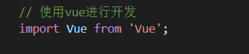
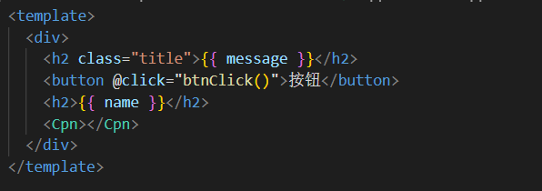

# Vue Day 01

### 一. 邂逅Vuejs

#### 1.1 认识Vuejs

- 为什么学习Vuejs
- Vue的读音
  Vue (读音 /vjuː/，类似于 **view**)

- Vue的渐进式
- Vue的特点

#### 1.2 安装Vue

- CDN引入
- 下载引入
- npm安装

#### 1.3 Vue的初体验

- Hello Vuejs
  - mustache -> 体验vue响应式

- Vue列表展示
  - v-for
  - 后面给数组追加元素的时候，新的元素也可以在界面中渲染出来
- Vue计数器小案例
  - 事件监听：click ->methods

#### 1.4 Vue中的MVVM

#### 1.5 创建Vue时，options可以放哪些东西

- el:
- data:
- methods:
- 生命周期函数

### 二、插值语法

- mustache语法
- v-once
- v-html
- v-text
- v-pre: 直接跳过Vue的解析过程，将原本包含{{}}的内容展示出来
- v-cloak:斗篷

### 三、动态绑定属性 v-bind

#### 3.1 v-bind绑定基本属性

- v-bind: src
- v-bind: href

#### 3.2 v-bind动态绑定class

- 对象语法：class='{类名:boolean}'
- 数组语法：

#### 3.3 v-bind动态绑定style

- 对象语法：
- 数组语法：

### 四、计算属性

- 案例一：firstName + lastName
- 案例二：books ->price

#### 4.1 计算属性的本质

- fullname: {set(), get()}

#### 4.2 计算属性和methods的对比

- 计算属性在多次使用时，只会调用一次
- 计算属性有缓存

# Vue Day 02

### 一、事件监听

#### 1.1 事件监听的基本使用

- v-on
- 语法糖：@

#### 1.2 参数问题

- btnClick
  不需要传递参数时括号可以省略
- btnClick(event)
  若省略了括号，但是调用了参数，默认传递的是触发事件的event对象
- btnClick(abc,event) -> $event
  若传递了参数（abc），同时也需要event时，通过$event传递

#### 1.3 修饰符

- .stop()
  阻止冒泡
- .prevent()
- .enter
  限定触发按键为enter，类似按键很多
- .once
  只触发一次
- .native

### 二、条件判断

#### 2.1 v-if/v-else-if/v-else

#### 2.2 登录小案例

- 小问题：遇到判断切换时，input框内已输入的内容没有切换
  原因是Vue内部的Diff算法问题，解决方案为添加一个不同的key属性值

#### 2.3 v-show

- v-show和v-if的区别
  - v-show是改变了元素的display样式使其隐藏或者显示
  - v-if是选择是否渲染该元素，若为false，则不渲染，DOM树里就不存在该元素

### 三、循环遍历

- v-for

#### 3.1 遍历数组

- 有索引值和没有索引值的情况

#### 3.2 遍历对象

- value
- value,key
- value,key,index

#### 3.3 数组的哪些方法是响应式的

#### 3.4 作业完成

### 四、书籍案例

- 实现书籍响应式的添加、删除，购买数量的添加和减少，以及价格的汇总
- 当书籍全部清空时，隐藏界面，显示提示信息：购物车为空

### 五、v-model的使用

#### 5.1 基本使用

- v-model 原理=> v-bind:value v-on:input

#### 5.2 v-model和radio/checkbox/select的配合使用

#### 5.3 修饰符

- lazy
  等用户输入框接收enter或者失去焦点时修改
- number
  讲输入内容转换为数值处理
- trim
  清楚输入内容左右的空格

### 六、组件化开发

#### 6.1 认识组件化

- 组件化的概念
  将较为复杂的逻辑处理页面分隔成较为简单可处理的几个小的组件进行逻辑处理
- 组件化的步骤

#### 6.2 组件的基本使用过程

#### 6.3 全局组件和局部组件

#### 6.4 父组件和子组件的概念

#### 6.5 组件注册的语法糖

#### 6.6 组件模板的分离写法

- script写法
- template写法

#### 6.7 数据的存放

- 子组件不能直接访问父组件
- 子组件中有自己的data
  data必须是一个函数，有返回值（可返回一个对象）
- 子组件的data为什么必须是一个函数

#### 6.8 父子组件的通信

- 父传子
  - props()
- 子传父
  - $emit()

# Vue Day 03

### 一、组件化开发补充

#### 1.1 父子组件的访问

- $children/$refs
- $parent/$root

#### 1.2 插槽slot的使用

- 基本使用
- 具名插槽
  - 给插槽起id，根据id查找替换某一个插槽
- 编译作用域
  - 编译整个模板时的，在里面使用的变量，都只会在当前作用域里查找
- 作用域插槽
  - 父组件对子组件展示内容的方式不满足，父组件决定自己展示，但数据来自于子组件

### 二、前端模块化开发

#### 2.1 为什么要使用模块化

- 简单写js代码带来的问题

  - 全局变量命名冲突的问题

  - 
  - 

- 闭包引起的问题

  - 代码不可复用

- 实现了简单的模块化

- AMD/CMD/CommonJS模块化开发规范

#### 2.2 ES6中模块化的使用

- export导出
- import导入

### 三、webpack

#### 3.0 webpack和grunt/gulp的对比（面试可能会问）

- grunt/gulp的核心是Task
  - 可以配置一系列的task，并且定义task要处理的事务（例如ES6、ts转化，图片压缩，scss转成css）
  - 之后让grunt/gulp来依次执行这些task，而且让整个流程自动化
  - grunt/gulp也被称为前端自动化任务管理工具
- 与webpack的不同
  - grunt/gulp更加强调的是**前端流程的自动化**，模块化不是他的核心
  - webpack更加强调**模块化**开发管理，而文件压缩合并、预处理等功能，送他附带的功能

#### 3.1 webpack安装

  - 首先安装Node.js，Node.js自带了软件包管理工具npm

  - 查看自己的node版本
    
    
  - 全局安装webpack（这里安装3.6.0是因为vue2 cli依赖该版本）
    
    
  - 局部安装webpack
    - --save--dev 是开发时依赖，项目打包以后不需要继续使用的
    
    
    

#### 3.2 准备工作

  - dist文件夹：用于存放之后打包的文件
  - src文件夹：用于存放我们写的源文件
    - index.js：项目的入口文件
    - mathUtils.js：定义了一些数学工具函数，可以在其他地方引用，并且使用
  - index.html：浏览器打开的展示的首页
  - package.json：通过 npm init 在终端生成，npm包管理的文件

    
#### 3.3 入口和出口
  - 每次使用webpack的命令都需要写入入口和出口作为参数，就非常麻烦，创建一个webpack.config.js文件来解决
  - 

#### 3.4 局部安装webpack

  - 使用的webpack打包是全局的webpack，如果想用局部来打包
    - 因为一个项目往往以来特定的webpack版本，全局的版本可能跟这个项目的webpack版本不一致，导致打包出现问题。
    - 所以通常一个项目，都有自己的局部webpack
  - 第一步，在项目中需要安装自己的局部webpack
    - 这里我们让局部安装webpack3.6.0
    - Vue CLI3中已经升级到webpack4，但是他将配置文件隐藏了起来，查看起来不是很方便
  - 第二步，通过 node_modules/.bin/webpack 启动webpack打包

#### 3.5 package.json中定义启动

  - 每次都敲上面那一长串很不方便，所以在package.json中的scripts中定义自己的执行脚本
    

  - package.json中的scripts的脚本在执行时，会按照一定的顺序寻找命令对应的位置
    - 首先，会寻找本地的node_modules/.bin路径中对应的命令
    - 如果没有找到，就会去全局的环境变量中寻找
    - 如何执行build指令
      

#### 3.6 webpack的loader

- loader是webpack中的非常核心的概念
- loader的作用
  - 主要使用webpack来处理js代码，以及js代码之间的一些依赖，而处理其他文件以及他们的依赖时webpack就无法做到
  - 给webpack扩展对应的loader，可以将需要加载的css、图片，也包括一些高级的将ES6转成ES5代码，将Typescript转换城ES5代码，将scss、less转成css，将.jsk、.vue文件转成js文件等等
- loader使用过程：
  - 步骤一、通过npm安装需要使用的loader
  - 步骤二、在webpack.config.js中的modules关键字下进行配置
- 大部分loader都可以在webpack的官网中找到，并且学习对应的用法
- 注意：**webpack在读取使用的loader时，是按照从右往左的顺序读取**，所以配置loader的顺序应该从右往左

#### 3.7 less文件处理 less-loader

- 准备工作
  - 若希望项目中使用less、scss、stylus来写样式，webpack打包配置大同小异
  - 以less为例
- 1.创建一个less文件，依然放在css文件夹中
  
- 在index.js添加依赖（添加依赖以后，打包时webpack会去寻找并进行打包）
  
- 官网查找并下载less的loader
  
- webpack.config.js里配置部署
  
- 在终端npm run build进行打包即可

#### 3.8 webpack-图片文件的处理

- 在样式中插入图片后直接打包会报错
  
- 官网寻找对应loader-文件loader-URLloader，并安装该loader
  
- webpack.config.js里配置部署
  
- 注意limit是限制图片大小（一般为**8192**），当图片小于limit时，会将图片编译成base64字符串形式展示，若图片大于limit，则会报错
  
- 当图片大小超出limit，他会去查找file-loader进行加载，则要么更改limit，要么**安装file-loader**
- 然后会将该图片进行打包到dist文件夹中（自动生成）
  
- 如上图，webpack自动生成了一个非常长的名字
  - 这是一个32位的hash值，目的是防止名字重复
  - 真实开发中可能对打包的图片名字有一定的要求
  - 所以可以在options中添加如下选项：
    - img：文件要打包到的文件夹
    - name：获取图片原来的名字，放在该位置
    - hash:8：为了防止图片名称冲突，依然使用hash，但只保留8位
    - ext：使用图片原来的扩展名
      
      生成的图片
      
- 生成路径不同，所以不会显示，需要在webpack.config.js里更改配置，更改后会自动在url路径前添加文件夹路径
  
  
- 注意：**一般实际开发中index.html文件也会被放入dist中，所以可能不需要更改路径配置，需要时记得删除**

#### 3.9 ES6语法转ES5语法处理（babel-loader）

- 如果你仔细阅读webpack打包的js文件夹，发现写的ES6语法并没有转成ES5的语法，那么就意味着一些可能对ES6还不支持的浏览器没有办法很好的运行代码
- 如果希望将ES6语法转成ES5语法，就需要使用babel。
  - 直接使用babel对应的loader就可以了
- 安装和配置方法查询webpack官网

#### 3.10 ★webpack的Vue配置（Vue的npm安装）

- 后续项目中，会使用Vuejs进行开发，会以特殊的文件（.vue的形式）来组织Vue的组件
- 所以需要在webpack环境中集成Vuejs
- 首先安装依赖（注意：实际项目中也会使用Vue，所以**不是开发时依赖**）
  

- 然后在index.js中进行引用依赖即可（**注意“vue”的大小写要与后面配置一致**），之后就可以在js内用Vuejs写代码
  

- **打包项目-错误信息**
  - 修改完成后重新打包，运行程序，打包过程没有错误，但运行程序没有得到想要的结果，浏览器报错
    
  - 这个错误说的是使用的是runtime-only版本的Vue
    - Vue不同版本的构建，有runtime-only和runtime-compiler的区别（后续会讲）
      - runtime-only -> 代码中不可以有任何的template
      - runtime-compiler -> 可以有template，因为有compiler可以用于编译template
  - 所以许要修改webpack.config.js的配置(**注意“vue$”大小写要与index.html引入vue时的“vue”大小写一致**)
    

#### 3.11 webpack中Vue的书写

- el和template的区别

  - 正常运行后，如果希望将Vue实例的data中的数据显示在界面中，就必须是修改index.html
- 如果后面定义了组件，也必须修改index.html来使用
  - 但是html模板在之后的开发中，并不希望手动的来频繁修改（如何解决？）
  - 所以可以定义一个template属性：
  
  - 定义template后，会将template内容自动替换掉el挂载的.html文件中的标签内（上图中的会**替换掉整个id为“#app“的div**）

#### 3.12 ★webpack组件和模板的抽离（模块化）

- 接上(3.11)，将内容全部写入实例中(特别是template内容的书写)，当代码量变大时会变得非常的繁琐，所以会选择将代码抽离
  - 在src下新建一个名为"vue"的文件夹，在内部可以建立一个app.js文件，将实例中的data、template、methods、computed等可使用的属性及内容抽离到app.js文件中，并匿名导出
    
  - 之后在index.js中导入该文件
    
  - 然后在Vue实例中通过components引入该组件，并在template属性中使用即可
    

- 但是即便如此，在app.js文件中写入代码也还是非常的不方便，template属性中的代码还是无法得到快捷输入方式和格式化，所以我们可以使用新的一种文件格式：.vue文件格式

  - 可在vue文件夹下新建一个App.vue文件（开头推荐大写）

  - 在该文件内写入template标签，并将app.js中的template内容抽离到该标签内（h2中的class属性可写样式，如下文）
    

  - 写入一个script标签，将app.js文件中的其他属性和内容写入为一个新的组件并且匿名导出
    

  - 若有需求要对该组件进行样式修改，可以写入一个style标签，并对template标签内的元素编写样式
    

  - 此时原来的app.js文件就失去作用，index.js中引入的文件更改为
    

    

#### 3.12-拓展 组件的使用

- 3.12中实现了对实例的组件化抽离，那如果在该实例中想要创建新的组件模板和注册组件该怎么办？
  - 在vue文件夹中新建一个Cpn.vue的文件，在该文件中写入创建的新组件—Cpn，并**匿名导出**
    
  - 在Vue实例文件app.vue中的script标签中**命名导入**该文件
    
  - 在实例组件内通过components属性引入即可
    

​    

#### 3.13 .vue文件封装处理

- 一个组件以一个js对象的形式进行组织和使用是非常不方便的
  - 编写template模块非常的麻烦
  - 如果有样式的话，书写比较麻烦
- 可以使用**.vue文件**的方式来组织vue的组件
- 但是文件在先基础上无法被正常加载
  - 特殊的文件以及特殊的格式，需要loader来帮助处理
  - 安装vue-loader和vue-template-compiler
    
- 然后修改webpack.config.js的配置文件
  

- 此时运行可能会遇到一个问题，终端可能报错（vue-loader有许多版本，从14.x版本开始使用就需要配置另一个插件plugin，下文讲解）
  
  - 解决方案可在package.json文件中将vue-loader版本进行手动更改（图中表示会在13.x到14版本之间安装一个版本）
    
  - 然后进行配置安装：即可

#### 3.13-拓展 .vue文件在import导入时后缀名省略问题

- 在前面所讲的各种loader的使用中，可以发现在import引入文件时，路径文件的后缀名可以省略也不会出现问题（如.js、.less、.css等），但是.vue文件则无法省略，否则会出现找不到文件的报错
- 解决方式：修改package.config.js文件中的配置
  - 在resolve对象中新增一个属性，并赋值，值为想要省略的后缀名（以 **.后缀名** 的形式）：
    

#### 3.14 plugin的基本使用

- 认识plugin
  - plugin是插件的意思
    - webpack中的插件，就是对webpack现有功能的各种国战，比如打包优化、文件压缩等等
  - loader和plugin的区别
    - loader主要用于转换某些类型的模块，他本身是一个**转换器**
    - plugin时插件，它是对webpack本身的扩展，是一个**扩展器**
  - plugin的使用过程
    - 步骤一、通过npm安装需要使用的plugins（某些webpack已经内置的插件不需要安装）
    - 步骤二、在webpack.config.js中配置插件
- 好用的plugin
  - 1. 添加版权的plugin
    
    - BannerPlugin，属于webpack自带的内置插件
    - 可通过修改webpack.config.js的文件来进行配置
      - 添加文件导入
        
      - 在module.exports里新增属性和内容
        
      - 版权结果可到dist文件夹下的bundle.js里查看
        
    
  - 2.打包html的plugin

    - 开发时的index.html时存放在项目的根目录下，但真实发布项目时，发布的是**dist文件夹**中的内容，如果dist文件夹中没有index.html文件，那么打包的js文件也没有意义，所以需要将index.html文件打包到dist文件夹中，这个时候就需要使用**HtmlWebpackPlugin插件**

    - HtmlWebpackPlugin插件可以自动生成一个index.html文件（可以指定模板来生成），并将打包的js文件自动通过script标签插入到body中

    - 安装和配置可查官网

    - 在webpack.config.js中引入插件
      

    - 在plugins属性中添加HtmlWebpackPlugin插件
      

    - 打包之后会在dist目录下生成一个index.html文件
      

    - 注意：**但是此时的index.html文件内还有问题需要解决：**

      - 第一、文件自动引入的路径还不正确（此时的index.html和bundle.js文件处于同一目录下，应当更改）
        
      - 第二、将webpack.config.js文件中的自动添加dist/路径注释掉
        
      - 第三、设置自动生成原index.html中的元素信息，在配置文件中增加template，给他指定模板
        
      - 注意：**模板中引入bundle.js文件的script标签应当删除，因为新生成的.html文件中会自动引入**
        

  - 3.对JS进行压缩的Plugin

    - 在项目发布之前，需要对打包的js文件进行压缩

    - 我们使用一个第三方的插件 uglifyjs-webpack-plugin ，学习中我们将版本号指定为1.1.1，和CLI2保持一致（**uglify：丑化**）
      

    - 修改webpack.config.js文件配置
      

      

    - 之后再重新打包，bundle.js文件便变成了丑化的压缩模式（**此时版权声明会被删除**）
      

#### 3.15 webpack搭建本地服务器

- webpack提供了一个可选的本地开发服务器，这个本地服务器**基于node.js搭建**，内部使用**express框架**，可以实现让浏览器自动刷新显示我们修改后的结果
- 它是一个单独的模块，再webpack使用之前需要安装他（学习中我们设置版本号为2.9.1）
- devserver也是作为webpack中的一个选项，选项本身可以设置如下属性（在webpack.config.js中）：

  - contentBase：为拿一个文件夹提供本地服务，默认是根文件夹，在这里我们要写./dist

  - port：端口号（不指定默认8080端口）

  - inline：页面实时刷新

  - historyApiFallback：再SPA页面下，依赖HTML5的history模式
    

  - 注意：**此时运行不再是使用原来的webpack 或者npm run build，而是需要去相对路径下寻找指令**
    

  - 但每次敲这么长的指令未免非常的麻烦，所以：

    - 我们可以给这个指令在package.json文件的script下添加一个脚本
      
    - 然后就可以类似build一样通过快捷指令运行
      
    - 此后对代码的修改何测试，保存以后页面会自动刷新，测试完成以后在进行webpack打包操作
    - 若想要运行上面代码以后自动弹出浏览器，可在脚本后面添加 --open即可
      

#### 3.16 webpack配置的分离

- 注意：**一般在测试阶段不需要对项目进行uglify丑化压缩，在真正发布时再加入丑化压缩，而在真正发布时，又不需要对项目搭建本地server，需要删除，所以：我们可以对这些不同阶段使用的配置文件进行抽离管理**
- 安装依赖（学习时版本4.1.5）
  
- 在根目录下新建一个build文件夹，把webpack.config.js的全部代码拷贝到build文件夹下新建的base.config.js文件内
  
- 在新建两个文件，一个仅管理开发时需要的配置（dev.config.js）,一个仅管理生产时需要的配置（prod.config.js）
  
- 将base.config.js文件夹内仅开发时需要的配置抽离到dev.config.js中，并进行导入文件和其他相关配置（base.config.js文件内保留公共部分）
  
- 同理配置prod.config.js文件
  
- 配置完成，原来的webpack.config.js文件可以删除，但此时若**直接进行打包或者运行本地服务器**，会报错(找不到文件)
  
- 所以最后一步需要在package.json文件中修改脚本指令
  
- 以及最后打包文件路径修改
  

### 四、Vue CLI

#### 4.1 什么是Vue CLI

- 如果你只是写几个Vue的demo程序，那不需要Vue CLI

- 如果你开发大型项目，那么你需要，且必然会用到Vue CLI

  - 开发大型项目时，需要考虑代码目录结构、项目结构和部署、热加载、代码单元测试等事情。
  - 如果每个项目都要手动完成这些工作，无疑效率非常低，所以通常会使用一些脚手架工具来帮助完成

- CLI的意思

  - CLI是Command-Line Interface，翻译为命令行界面，俗称脚手架
- Vue CLI是官方发布Vue.js项目脚手架
  - 使用vue-cli可以快速搭建Vue开发环境以及对应的webpack配置

  

#### 4.2 Vue CLI使用的前提1 - Node

- 安装NodeJS
  - 可以直接在官方网站中下载安装（http://nodejs.cn/download/）
- 检测安装的版本
  - 默认情况下自动安装Node和NPM
  - Node环境要求8.9以上或者更高版本
    
- 小技巧：**cnpm安装**
  - 由于国内直接使用npm的官方镜像是非常慢的，如果没有开代理，这里推荐使用淘宝NPM镜像
  - 可以使用淘宝定制的cnpm（gzip压缩支持）命令行工具代替默认的npm：
    
  - 这样就可以使用cnpm命令来安装模块了
    

#### 4.3 Vue CLI使用的前提2 - webpack

- Vue.js官方脚手架工具使用了webpack模板
  - 对所有资源会压缩等优化操作
  - 开发过程中提供了一套完整的功能，能够使得我们开发过程中变得更高效
- webpack的全局安装（**前面学习webpack早就已经安装完毕了**）
  - npm install webpack -g

#### 4.4 Vue CLI的使用

- 安装Vue脚手架，直接安装到全局即可
  
- 但安装后的vue-cli版本号比较新，，如果想要按照Vue CLI2的方式初始化项目是行不通的，所以我们需要拉取2.x的模板（旧版本）
  

- Vue CLI2初始化项目（一般开发中项目名字不要有中文）
  

- 初始化项目中会有许多选项供选择
  
- 生成后的文件夹内容有很多（**目录结构详解**）
  

# Vue Day 04

### 一、Vue CLI续

#### 1.1 runtime-compiler和runtime-only的区别

- HTML代码都会写成template模板

- runtime-compiler解析过程（**大部分人选择**）

  - template -> ast(抽象语法树) -> render函数 -> virtual dom(虚拟dom) -> UI(真实dom)

- runtime-only解析过程（会使用则**更高效**）

  - render函数 -> virtual dom(虚拟dom) -> UI(真实dom)

  - 性能更高
  - 代码量更少
  - 所以会有该图中的小6kb的内容
    

#### 1.2 Vue CLI3的认识

- vue-cli3与2版本的区别
  - vue-cli3是基于webpack4打造的，vue-cli2是基于webpack3
  - vue-cli3的设计原则是“0配置”，移除了配置文件根目录下的 build 和config 等目录
  - vue-cli3提供了vue ui命令，提供了可视化配置，更加的人性化
  - 移除了static文件夹，新增了public文件夹，并且index.html移动到public中

- Vue CLI3初始化项目（一般开发中项目名字不要有中文）
  

### 二、Vue-Router

### 三、Vuex

### 四、网络请求封装（axios）

