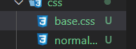

# 新项目思路流程

### 1.划分目录结构图解

### 2. 引用两个css文件进行样式统一

- 如图
  

#### 2.1 对不同浏览器标签样式进行统一

- 可以在Github搜索normalize
  

- 找到normalize文件进行下载，或者复制代码自己创建即可
  
  
  

#### 2.2 对本项目的样式统一

- 写入base样式文件中

### 3. 项目别名的配置

- 在src路径下新建一个固定名字为（vue.config.js）的js文件
  
- 在该文件中配置，会自动同步到项目配置中
  

### 4. 代码风格的统一

- CLI3以后editorconfig文件被移除了，但是在项目开发中，多人协作的代码风格统一是必要的
- 可以把以前的文件copy过来，或者从CLI2新建的项目中再拿过来
  

### 5. 项目模块划分

- tabbar
- 路由映射关系

### 6. 轮播图不是自己写的，需要重新学习

- 如图的文件夹内的东西需要自己在学习
  

